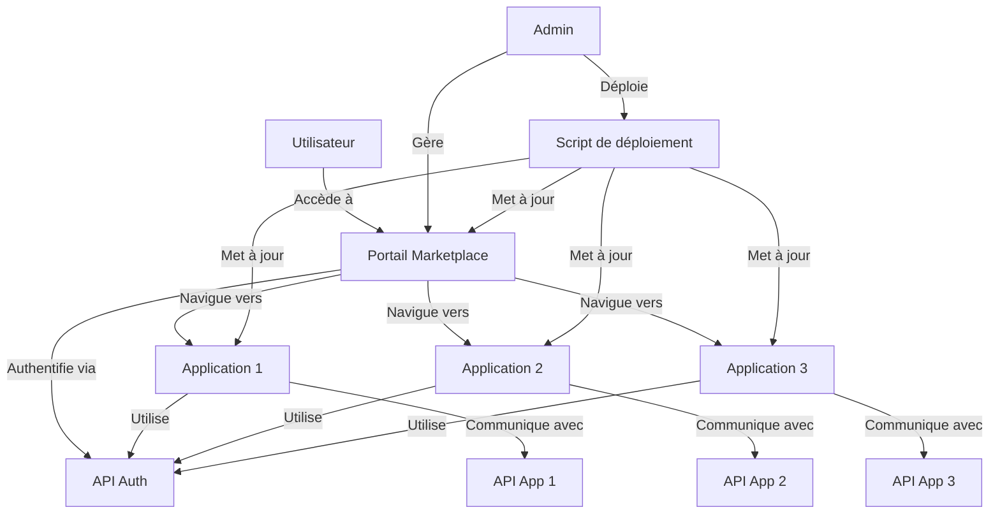
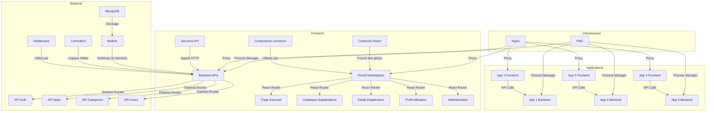
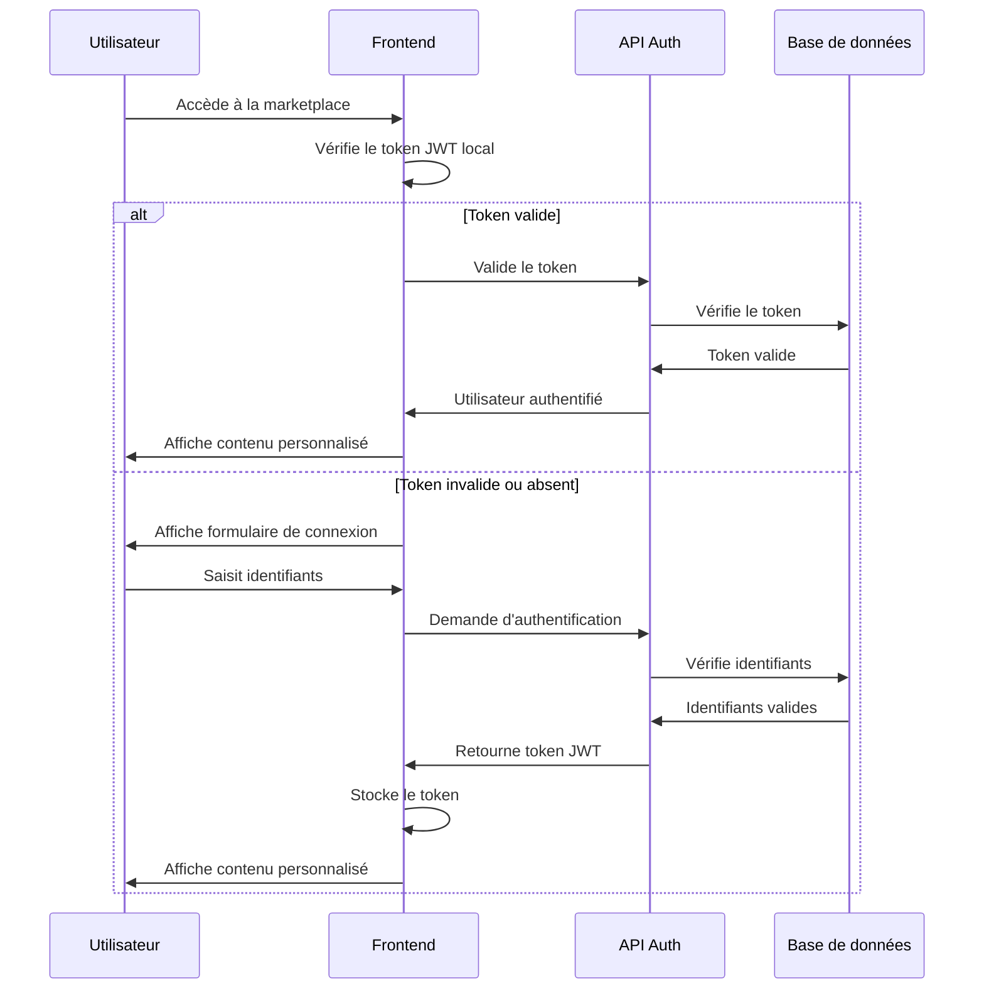

# Expression de besoin - Marketplace Web

## Présentation générale

La Marketplace Web est une plateforme moderne et élégante permettant de présenter, distribuer et gérer diverses applications web. Chaque application est autonome avec son propre frontend et backend, tout en étant intégrée de manière cohérente dans l'écosystème de la marketplace.

Cette plateforme vise à offrir un point d'accès centralisé à un ensemble d'applications développées en interne ou par des partenaires, avec une expérience utilisateur unifiée et une gestion simplifiée des accès et des déploiements.

## Objectifs et vision

### Objectifs principaux

1. **Centralisation des applications** : Offrir un point d'accès unique à toutes les applications web de l'organisation
2. **Expérience utilisateur cohérente** : Garantir une navigation fluide et une interface homogène entre les différentes applications
3. **Gestion simplifiée** : Faciliter le déploiement, la mise à jour et la maintenance des applications
4. **Évolutivité** : Permettre l'ajout facile de nouvelles applications à la marketplace
5. **Sécurité** : Assurer une gestion centralisée des authentifications et des autorisations

### Vision à long terme

La Marketplace Web a pour ambition de devenir le hub central de toutes les applications web de l'organisation, offrant :

- Une bibliothèque d'applications en constante expansion
- Des mécanismes d'intégration standardisés pour les nouvelles applications
- Des outils d'analyse et de reporting sur l'utilisation des applications
- Un système de recommandation basé sur les profils utilisateurs
- Des fonctionnalités sociales (évaluations, commentaires, partage)

## Architecture technique

### Vue d'ensemble

### Architecture détaillée

### Flux d'authentification

## Fonctionnalités principales

### Portail principal

1. **Page d'accueil**
   - Présentation de la marketplace
   - Applications vedettes
   - Catégories populaires
   - Recherche d'applications

2. **Catalogue d'applications**
   - Liste des applications disponibles
   - Filtrage par catégorie
   - Tri par popularité, date, etc.
   - Recherche avancée

3. **Détail d'application**
   - Description détaillée
   - Captures d'écran
   - Évaluations et commentaires
   - Bouton d'accès à l'application

4. **Profil utilisateur**
   - Informations personnelles
   - Applications favorites
   - Historique d'utilisation
   - Paramètres de compte

5. **Administration**
   - Gestion des applications
   - Gestion des utilisateurs
   - Statistiques d'utilisation
   - Configuration de la marketplace

### Système d'authentification

1. **Inscription**
   - Création de compte
   - Validation par email
   - Profil utilisateur

2. **Connexion**
   - Authentification par email/mot de passe
   - Authentification par SSO (optionnel)
   - Récupération de mot de passe

3. **Gestion des sessions**
   - Tokens JWT
   - Rafraîchissement automatique
   - Déconnexion sécurisée

### Applications intégrées

Chaque application intégrée à la marketplace doit :

1. Utiliser le système d'authentification centralisé
2. Respecter les standards d'interface utilisateur
3. Fournir des métadonnées (nom, description, catégorie, etc.)
4. Exposer des points d'API pour l'intégration avec le portail

## Spécifications techniques

### Frontend

- **Framework** : React 18+
- **Routing** : React Router 6+
- **UI Components** : Material UI 5+
- **State Management** : Context API + Hooks
- **HTTP Client** : Axios
- **Authentication** : JWT

### Backend

- **Runtime** : Node.js 18+
- **Framework** : Express.js
- **Database** : MongoDB
- **Authentication** : JWT + bcrypt
- **Validation** : express-validator
- **Logging** : Morgan + Winston

### Infrastructure

- **Serveur Web** : Nginx
- **Process Manager** : PM2
- **Déploiement** : Scripts bash personnalisés
- **Monitoring** : PM2 + Prometheus (optionnel)

## Plan de mise en œuvre

### Phase 1 : Fondations (Semaines 1-2)

- Mise en place de l'architecture de base
- Développement du système d'authentification
- Création du portail principal (structure)
- Configuration de l'infrastructure

### Phase 2 : Fonctionnalités essentielles (Semaines 3-4)

- Développement du catalogue d'applications
- Intégration des détails d'application
- Système de recherche et filtrage
- Profils utilisateurs basiques

### Phase 3 : Intégration d'applications (Semaines 5-6)

- Développement de l'application exemple "Transkryptor"
- Intégration avec le portail principal
- Tests d'authentification unifiée
- Documentation pour l'intégration de nouvelles applications

### Phase 4 : Administration et finalisation (Semaines 7-8)

- Développement du panneau d'administration
- Statistiques et rapports
- Tests de performance et sécurité
- Documentation utilisateur et technique

## Conclusion

La Marketplace Web représente une évolution significative dans la gestion et la distribution des applications web de l'organisation. En centralisant l'accès et en uniformisant l'expérience utilisateur, elle permettra d'améliorer l'efficacité opérationnelle tout en offrant une plateforme évolutive pour les développements futurs.

Ce projet s'inscrit dans une stratégie plus large de modernisation des outils numériques et de renforcement de la cohérence de l'écosystème applicatif de l'organisation.
